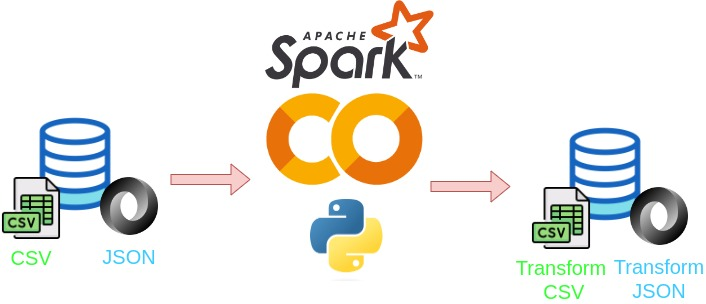

<h1>
<b>Procesamiento masivo de datos para la homologación de universidades con Spark</b>
</h1>

### <h2><b> ℹ️ Descripción</b></h2>

En este proyecto de procesamiento de datos con Spark sobre una fuente de datos de homologación de nombres de universidades, se realizó lo siguiente:

1. Se leyeron dos archivos: "instituciones_educativas.csv" y "universidades.json".
2. Se limpiaron los datos eliminando espacios en blanco y caracteres no alfanuméricos.
3. Se implementó una función que compara un texto con el nombre y las siglas de una universidad y determina si son similares.
4. Se realizó un join entre el archivo csv y el archivo json utilizando la función de similitud para unir los registros de ambas tablas.
5. Se guardó el resultado del join en un archivo csv llamado "universidades_homologadas.csv".
6. Se agruparon las universidades homologadas por su nombre y se obtuvieron sus sinónimos.
7. Los nombres y sinónimos de las universidades homologadas se guardaron en un archivo json llamado "sinonimo_universidades.json".

En resumen, el proyecto permitió homologar los nombres de diferentes universidades y obtener sus posibles sinónimos para facilitar el análisis de datos y la identificación de relaciones entre universidades.

## <h2><b>Pipeline</b></h2>

Pipeline del trabajo realizado.

## Archivos Transformados

- universidades_homologadas.csv [aquí](https://drive.google.com/file/d/1Y3wAf7XwZM7YYCIPkTFu94gciffklDxw/view?usp=sharing)

- sinonimo_universidades.json [aquí](https://drive.google.com/file/d/1lGHHJ9KjZ6S9lHjD6FzyiwFb6WFVv9-Q/view?usp=sharing)

## 👨‍💻 Maintainers
* Alexander Lique, Github: [alexliqu09](https://github.com/alexliqu09)